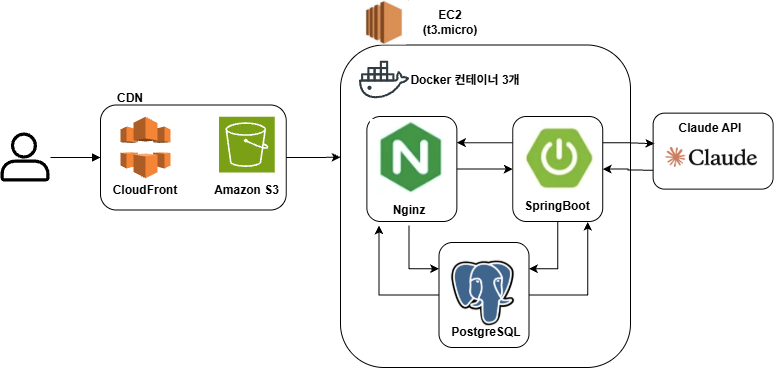
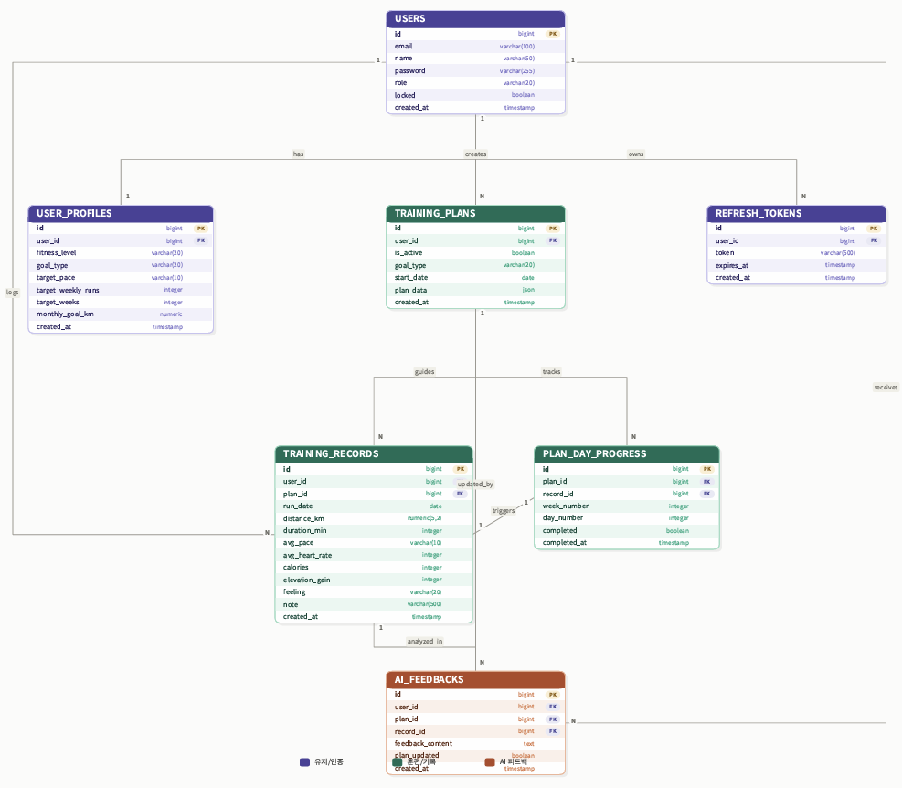

# RunMate AI

AI가 러닝 기록을 분석해 훈련 플랜을 자동으로 생성하고, 기록이 쌓일 때마다 코칭 피드백과 함께 플랜을 조정해주는 AI 러닝 코칭 서비스입니다.

**🔗 Live Demo**: https://d32emmykc8fvd6.cloudfront.net  
**📘 API 문서 (Swagger)**: https://d32emmykc8fvd6.cloudfront.net/swagger-ui.html  
**📝 트러블슈팅 & 성능 개선 기록**: https://app.notion.com/p/38864982b5af80a6b84fc5ee63f31e1b?source=copy_link

---

## 목차

- [주요 기능](#주요-기능)
- [기술 스택](#기술-스택)
- [아키텍처](#아키텍처)
- [ERD](#erd)
- [트러블슈팅 & 성능 개선](#트러블슈팅--성능-개선)
- [로컬 실행 방법](#로컬-실행-방법)
- [프로젝트 구조](#프로젝트-구조)


## 주요 기능

- **JWT 기반 인증/인가** — Access/Refresh Token 발급, 토큰 재발급, 회원 관리
- **AI 훈련 플랜 자동 생성** — Claude API가 개인 프로필(목표, 페이스, 주간 러닝 횟수 등)을 바탕으로 맞춤 훈련 플랜 생성
- **러닝 기록 관리** — 기록 CRUD, 플랜 대비 일자별 완료 여부 자동 평가
- **AI 피드백** — 러닝 기록 분석 후 코칭 피드백 제공, 필요 시 남은 훈련 일정을 자동으로 재조정
- **통계 대시보드** — 총 거리/페이스/스트릭/목표별 베스트 기록 등 집계 지표 제공
- **관리자 기능** — 회원 목록 조회, 계정 잠금/해제, 강제 삭제 (역할 기반 접근 제어)


## 기술 스택

**Backend**
      

**Frontend**
  

**Infra & DevOps**
    
## 아키텍처



- **배포**: GitHub Actions로 main 브랜치 push 시 자동 배포. 백엔드는 Docker 이미지 빌드 → GHCR push → EC2가 pull 받아 재배포하며, 배포 마지막에 `/actuator/health` 헬스체크를 폴링해 정상 기동을 확인한 뒤에만 배포를 성공 처리한다. 프론트엔드는 `npm build` → S3 업로드 → CloudFront 캐시 무효화로 배포된다.
- **DB 스키마 관리**: 초기에는 `ddl-auto: update`에 의존해 스키마 변경 이력이 코드로 추적되지 않았고, 실제로 유니크 인덱스가 이력 없이 유실되는 사고로 이어졌다. 이후 Flyway를 도입해 모든 스키마 변경을 버전 관리하고, `ddl-auto`는 `validate`로 전환해 엔티티와 실제 스키마가 어긋나면 배포 자체가 실패하도록 안전장치를 마련했다.
- **커넥션 관리**: HikariCP 풀 크기를 t3.micro(RAM 1GB) 환경에 맞게 실측 기반으로 조정했고, 외부 API(Claude) 호출을 DB 트랜잭션 밖으로 분리해 커넥션 점유 시간을 최소화했다.

## ERD



## 트러블슈팅 & 성능 개선

개발 과정에서 실측(k6 부하테스트, EXPLAIN ANALYZE, pg_stat_activity)을 기반으로 진행한 주요 개선 작업입니다. 짐작이 아니라 데이터로 원인을 확정한 뒤 해결했다는 점에 초점을 맞췄습니다. 각 항목의 상세한 문제 상황 / 원인 분석 / 해결 방법 / 검증 결과는 Notion 문서에 정리되어 있습니다.

| 항목 | 요약 |
| --- | --- |
| 통계 조회 API 성능 최적화 | 애플리케이션 레벨 집계 → DB 집계 쿼리 전환, 인덱스 추가, 트랜잭션 경계 정리로 평균 응답시간 **264.79ms → 25.22ms (약 90.5% 개선)** |
| HikariCP 커넥션 풀 튜닝 | 근거 없이 쓰던 기본값 대신, 실측 데이터로 t3.micro 환경에 맞는 풀 크기 결정 |
| 동시 요청 경쟁 상태(Race Condition) 해결 | 동시 플랜 생성 요청 시 발생하던 500 에러를 원인 추적 후 해결 (예외 로깅 보강, 유니크 인덱스 복구, 동시성 락 적용) |
| 외부 API 호출과 DB 트랜잭션 분리 | Claude API 호출이 DB 커넥션을 장시간 점유하던 구조를 개선, 트랜잭션 점유 시간을 초 단위에서 ms 단위로 단축 |
| 예외 처리 세분화 | 뭉뚱그려져 있던 400/500 응답을 401/403/404/409로 세분화, 처리되지 않은 예외의 로깅 누락 등 부수적으로 발견한 버그 함께 수정 |
| Flyway 도입 | `ddl-auto: update` 의존으로 인해 스키마 변경 이력이 추적되지 않던 문제를 해결, 이후 모든 스키마 변경을 버전 관리 |
| CI/CD 배포 신뢰성 개선 | 배포 스크립트가 실패해도 "성공"으로 표시되던 문제를 발견해 수정, 배포 후 헬스체크 검증 단계 추가 |
| 관리자 기능 (역할 기반 접근 제어) | Role/계정 잠금 필드 설계, `/api/admin/**` 경로 보호, 인증(401)/인가(403) 응답 포맷 통일 |

## 로컬 실행 방법

### 사전 요구사항
- Java 17
- Docker / Docker Compose

### 1. 저장소 클론
```bash
git clone https://github.com/mmm806/runmateai-backend.git
cd runmateai-backend
```

### 2. 환경변수 설정
`.env.example`을 참고해 필요한 환경변수(DB 접속 정보, JWT secret, Claude API key 등)를 설정합니다.

### 3. 로컬 DB 실행
```bash
docker compose up -d
```

### 4. 애플리케이션 실행
```bash
./gradlew bootRun
```
애플리케이션 시작 시 Flyway가 자동으로 스키마를 생성합니다.

### 5. API 문서 확인
로컬 실행 후 http://localhost:8080/swagger-ui.html 에서 전체 API 명세를 확인할 수 있습니다.

## 프로젝트 구조

```
src/main/java/com/example/runmateaibackend/
├── domain/
│   ├── admin/       # 관리자 기능 (회원 관리)
│   ├── feedback/    # AI 피드백
│   ├── plan/        # 훈련 플랜
│   ├── record/      # 러닝 기록
│   └── user/        # 인증/회원
├── global/
│   ├── config/      # Security 등 설정
│   ├── exception/   # 커스텀 예외, 전역 예외 처리
│   ├── jwt/         # JWT 필터, 인증/인가 핸들러
│   └── client/      # Claude API 클라이언트
└── resources/
    └── db/migration/  # Flyway 마이그레이션 파일
```

---

*이 문서는 프로젝트가 진행됨에 따라 계속 업데이트됩니다.*